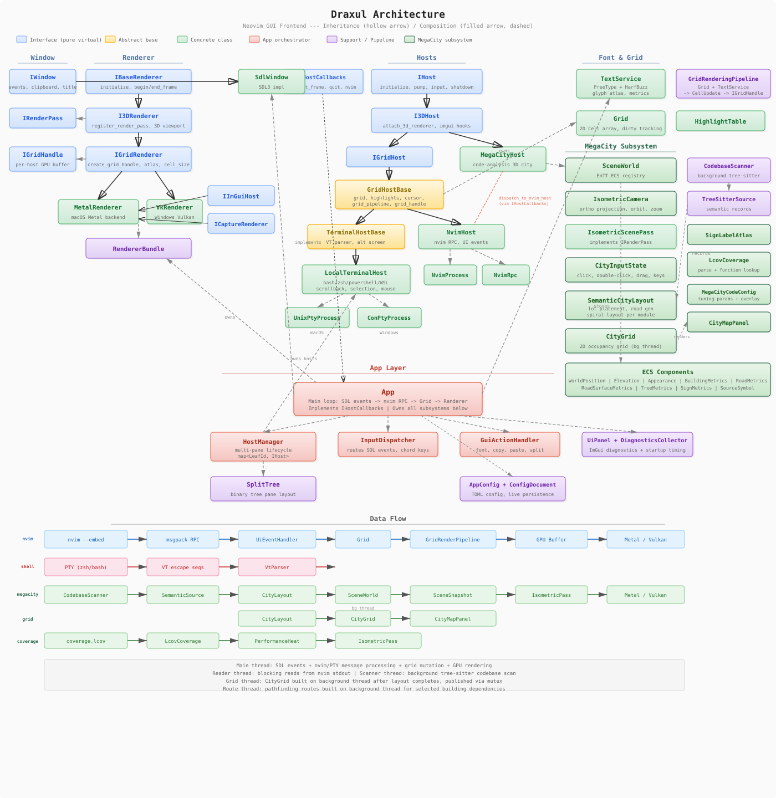
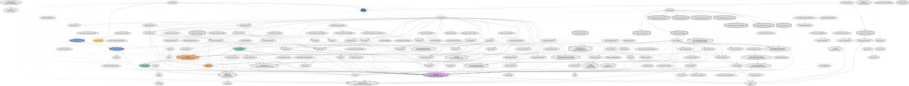
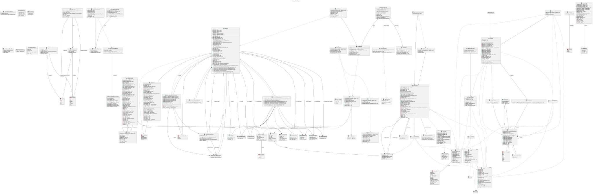
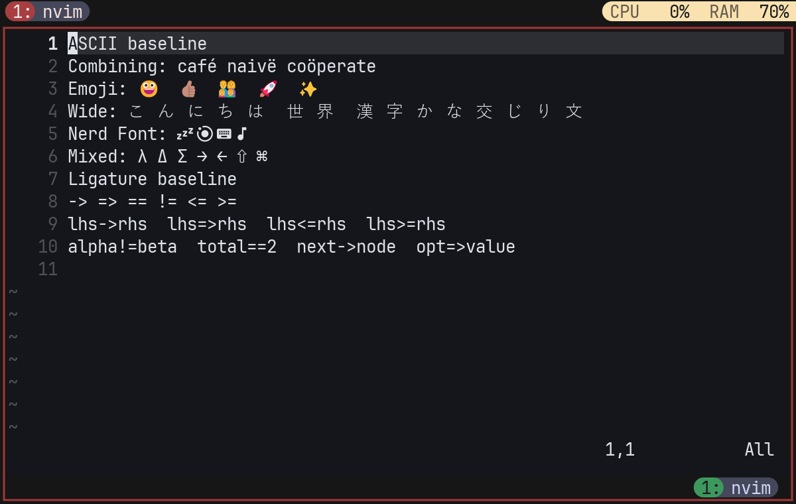

# Draxul

[](https://github.com/cmaughan/Draxul/actions/workflows/build.yml)

API docs: **[chrismaughan.com/Draxul](http://chrismaughan.com/Draxul/)** — or generate locally with `python scripts/gen_api_docs.py`.

## What is Draxul?

An experimental **Dark Factory Agentic** project with deep visualization of generated code.

- **GPU-accelerated terminal host** — cross-platform (Vulkan on Windows, Metal on macOS) terminal for PowerShell, WSL, Bash, Zsh, Git, and more
- **Neovim GUI frontend** — a full-featured replacement for nvim-qt, with deep `nvim --embed` integration over msgpack-RPC
- **Interactive city view of a codebase** — a living 3D city where buildings represent code modules, with live performance and test coverage overlays, clickable links back to source. The city is a human metaphor for the code an agent is building: interactive, informative, and introspective. Richard Wettle tried this back in 2007; we are giving it another go! Here's his site: https://wettel.github.io/codecity.html
- **High-end renderer** — a cross-platform game engine-style rendering pipeline with ambient occlusion, shadow maps, anti-aliasing, HDR, and more

**None of the code has been human-written.** Draxul is 100% agentically coded using multiple agents on Claude, Codex, and Gemini. Code reviews, feature updates, and planning are managed by agents with a human arbiter. A part-time project, built in less than 3 weeks at time of writing — several person-years of equivalent effort.

### macOS


### Windows


## Gallery

_Click any image to view full size._

<table>
<tr>
<td align="center"><a href="screenshots/terminals_mac.png"></a><br><em>Terminal host — Neovim with file tree</em></td>
<td align="center"><a href="screenshots/terminals_mac_2.png"></a><br><em>Terminal host — multi-pane with htop</em></td>
</tr>
<tr>
<td align="center"><a href="screenshots/split_panes_mac.png"></a><br><em>Split panes with city view</em></td>
<td align="center"><a href="screenshots/tree_mac.png"></a><br><em>City view with debug overlays</em></td>
</tr>
<tr>
<td align="center"><a href="screenshots/inspection_mac.png"></a><br><em>Building inspection panel</em></td>
<td align="center"><a href="screenshots/app_connections_mac.png"></a><br><em>App module connections</em></td>
</tr>
<tr>
<td align="center"><a href="screenshots/renderer_connections_mac.png"></a><br><em>Renderer module connections</em></td>
<td align="center"><a href="screenshots/coverage_connections_mac.png"></a><br><em>Coverage overlay connections</em></td>
</tr>
<tr>
<td align="center"><a href="screenshots/tooltip_link_mac.png"></a><br><em>Tooltip with source link</em></td>
<td align="center"><a href="screenshots/live_coverage_pc.png"></a><br><em>Live coverage overlay (Windows)</em></td>
</tr>
<tr>
<td align="center"><a href="screenshots/test_coverage_mac.png"></a><br><em>Test coverage heatmap</em></td>
<td align="center"><a href="screenshots/test_coverage_2_mac.png"></a><br><em>Test coverage detail</em></td>
</tr>
<tr>
<td align="center"><a href="screenshots/draxul-overlay-mac.png"></a><br><em>Diagnostics panel</em></td>
<td align="center"><a href="screenshots/function_buildings_mac.png"></a><br><em>Visualizing Git's source code</em></td>
</tr>
</table>

## Features

For the full user-facing feature reference — config options, keybindings, terminal behaviour, mouse support, scrollback, and more — see **[docs/features.md](docs/features.md)** (detail pages for the larger hosts live under [docs/features/](docs/features/)).

- **Terminal emulator** — run `zsh`, `bash`, `powershell`, or any shell; cross-platform
- **Neovim GUI** — full ext_linegrid UI with deep Neovim integration
- FreeType + HarfBuzz text pipeline with a dynamic glyph atlas
- Font fallback for Nerd Font, emoji, and plugin glyph coverage
- Configurable GUI shortcuts for the diagnostics panel, clipboard copy/paste, and font zoom
- Mouse input support for click, drag, and wheel events
- HiDPI / Retina-aware rendering with correct DPI font scaling
- Shared logging with console/file fallback and category filtering
- Thin app layer with separate window, renderer, font, grid, and Neovim modules
- Built-in diagnostics panel (toggle with `F12`) with live renderer, layout, and startup timing

## Requirements

### Windows

- CMake 3.25+
- Visual Studio 2022
- Vulkan SDK with `glslc`
- `nvim` on `PATH` (optional — required only for Neovim mode)

### macOS

- CMake 3.25+
- Xcode Command Line Tools
- `nvim` on `PATH` (optional — required only for Neovim mode)

All other dependencies are fetched automatically with CMake `FetchContent`.

## Building

### Windows

Debug:

```powershell
cmake --preset default
cmake --build build --config Debug --parallel
```

Release:

```powershell
cmake --preset release
cmake --build build --config Release --parallel
```

### macOS

Debug:

```bash
cmake --preset mac-debug
cmake --build build --parallel
```

Release:

```bash
cmake --preset mac-release
cmake --build build --parallel
```

## Running

With no arguments, Draxul discovers or starts the per-user Draxul server and opens
its shared default shell Session. Closing the UI leaves the server, shells, Spaces,
and agents running; the next UI reconnects to them. Use `--no-server` for a
client-owned recovery shell, or select a standalone product explicitly with `--host`.

### Windows

```powershell
.\build-ninja-release\draxul.exe                         # shared PowerShell Session
.\build-ninja-release\draxul.exe --no-server             # client-owned recovery shell
.\build-ninja-release\draxul.exe --host nvim             # embedded Neovim
.\build-ninja-release\draxul.exe --host powershell       # shared PowerShell Session
.\build-ninja-release\draxul.exe --host megacity --source C:\dev\linux
.\build-ninja-release\draxul.exe --server-status
.\build-ninja-release\draxul.exe --list-sessions          # live server Sessions
.\build-ninja-release\draxul.exe --delete-session --session work --yes
.\build-ninja-release\draxul.exe --shutdown-server --yes # confirms live-shell shutdown
```

The server also exposes a Windows notification-area status menu with Open Draxul,
status counts, log access, and guarded stop actions.

### macOS

```bash
./build/draxul.app/Contents/MacOS/draxul                # shared login-shell Session
./build/draxul.app/Contents/MacOS/draxul --no-server    # client-owned recovery shell
./build/draxul.app/Contents/MacOS/draxul --host nvim    # embedded Neovim
./build/draxul.app/Contents/MacOS/draxul --host zsh     # shared Zsh Session
./build/draxul.app/Contents/MacOS/draxul --host megacity --source ~/dev/linux  # MegaCity scan root override
```

Or launch via Finder / `open`:

```bash
open ./build/draxul.app
```

Supported `--host` values include `nvim`, `zsh`, `bash`, `powershell` / `pwsh`
(Windows), `wsl` (Windows), and built product hosts such as `megacity`.

`--source <path>` overrides the MegaCity Tree-sitter scan root when launching `--host megacity`.

## Configuration

Draxul stores user settings in a `config.toml` file under the platform app-config directory.

Programming ligatures are enabled by default. Set `enable_ligatures = false` if you prefer raw per-character glyphs.

GUI-level shortcuts can be remapped under a `[keybindings]` table:

```toml
enable_ligatures = true

[keybindings]
toggle_diagnostics = "F12"
copy = "Ctrl+Shift+C"
paste = "Ctrl+Shift+V"
font_increase = "Ctrl+="
font_decrease = "Ctrl+-"
font_reset = "Ctrl+0"
```

These bindings affect only Draxul-handled GUI actions. Normal Neovim input and keymaps still go through Neovim.

## Convenience Script: `do.py`

The root `do.py` script is the recommended entry point for common tasks:

```bash
./do.py run          # build (if needed) and launch Draxul
./do.py smoke        # build and run the startup smoke test
./do.py test         # fast unit suite (four C++ shards + do.py tests)
./do.py clean        # remove repository-root build/ and build-* directories

./do.py basic        # run basic-view render snapshot compare
./do.py cmdline      # run cmdline-view render snapshot compare
./do.py unicode      # run unicode-view render snapshot compare
./do.py panel        # run panel-view render snapshot compare
./do.py renderall    # run all four render snapshot compares

./do.py blessbasic   # bless basic-view reference image
./do.py blesscmdline # bless cmdline-view reference image
./do.py blessunicode # bless unicode-view reference image
./do.py blesspanel   # bless panel-view reference image
./do.py blessall     # bless all four reference images

./do.py api          # build local Doxygen API docs
./do.py docs         # build all documentation artifacts
./do.py shot         # regenerate the README hero screenshot
./do.py coverage     # macOS: export build/coverage.lcov and refresh db/coverage.lcov
```

On Windows, use `do <command>` (via `do.bat`) instead of `./do.py`.

```bash
do build relwithdebinfo  # Windows: optimized build with PDB symbols
do run                   # Debug build + run (ninja on Windows, make on macOS)
do run release           # Release build + run
do run relwithdebinfo    # Windows: optimized build with PDB symbols
do run release --vs      # Release build with VS generator (Windows)
do run --console         # Attach a debug console (Windows)
do run release --host megacity --parser graphify
                         # Configure MegaCity to use graphify-out/graph.json, then launch
do smoke                 # Smoke test
do test                  # Fast unit suite
do clean                 # Remove build/ and build-*/
```

`do.py clean` removes repository-root build trees named `build/` or `build-*` (including the Visual Studio, Ninja, and tooling build directories). It leaves deploy packages, render outputs, render references, databases, source files, and similarly named regular files untouched; running it when no matching build directory exists succeeds.

## Testing

The repository includes lightweight native tests for grid logic, redraw parsing, input translation, RPC behavior, renderer state, and Unicode width conformance against headless Neovim.

For the normal edit-test loop, `do.py test` (or `do test` on Windows) configures Debug as needed, builds only `draxul-tests` and its dependencies, then runs four disjoint Catch2 shards in parallel plus the Python `do.py` unit suite. It does not build or launch the Draxul application and does not run smoke or render comparisons.

Use `do.py smoke` and the render shortcuts when an application-facing change needs them. Before committing or releasing, use `./t.sh` on macOS or `t.bat` on Windows; those full-validation wrappers retain the unit, app-smoke, and available render-snapshot checks.

### Windows

Default is `Debug`:

```powershell
scripts\run_tests.bat
```

Other modes:

```powershell
scripts\run_tests.bat release
scripts\run_tests.bat both
scripts\run_tests.bat --reconfigure
scripts\run_tests.bat --verbose
scripts\run_tests.bat --unit
```

### macOS

Default is `Debug`:

```bash
./scripts/run_tests.sh
```

Other modes:

```bash
./scripts/run_tests.sh release
./scripts/run_tests.sh both
./scripts/run_tests.sh --reconfigure
./scripts/run_tests.sh --verbose
./scripts/run_tests.sh --unit
```

The test scripts reuse the existing CMake cache when possible and only reconfigure when needed. Their default is full validation; `--unit` selects the same fast unit-only path used by `do.py test`. By default they use failure-only CTest output so CI logs stay readable; pass `--verbose` when you want full per-test output locally.

The CTest suite also includes:

- an app startup smoke test when `nvim` is available on `PATH`
- a render snapshot regression test when the platform reference image exists under `tests/render/reference/`

## Render Snapshots

Draxul can now run deterministic render-snapshot tests by capturing pixels directly from the renderer output instead of taking a desktop screenshot.

Example compare run:

```powershell
.\build\Debug\draxul.exe --console --render-test D:\dev\draxul\tests\render\basic-view.toml
```

Bless a new reference image:

```powershell
.\build\Debug\draxul.exe --console --render-test D:\dev\draxul\tests\render\basic-view.toml --bless-render-test
```

Update the documentation screenshot for the current platform:

```powershell
python .\scripts\update_screenshot.py
```

Notes:

- `update_screenshot.py` uses the presentation-oriented `tests/render/readme-hero.toml` scenario by default, so it captures your normal Neovim theme and statusline instead of the clean `-u NONE --noplugin` regression setup.
- The deterministic render regression scenarios remain under `tests/render/` and continue to use fixed startup settings for stable compare/bless behavior.

Behavior:

- the scenario fixes window size, font, and Neovim startup commands
- Draxul waits for redraw activity to settle
- the renderer reads back the presented frame
- output is compared against a platform-specific reference image
- `actual`, `diff`, and `report` artifacts are written under `tests/render/out/`

Reference images live under `tests/render/reference/` with platform suffixes like `basic-view.windows.bmp` and `basic-view.macos.bmp`.

Current scenarios:

- `basic-view`: line numbers, signcolumn, cursorline, and baseline text layout
- `cmdline-view`: bottom-row command-line rendering
- `unicode-view`: graphemes, emoji, wide glyphs, and Nerd Font/plugin icons
- `panel-view`: visible diagnostics panel layout and content

## Logging

Draxul now uses a shared repo-local logger across the app, RPC/process layer, windowing, font stack, and renderers.

Environment controls:

```powershell
$env:DRAXUL_LOG = "debug"
$env:DRAXUL_LOG_CATEGORIES = "app,rpc,font"
$env:DRAXUL_LOG_FILE = "logs\\draxul.log"
```

Notes:

- Default level is `info`.
- Categories are comma-separated.
- GUI launches without a console will fall back to a log file automatically.
- The DPI diagnostics in the window layer are now `debug`-only instead of always-on.

## Diagnostics Panel

Press `F12` to toggle the built-in diagnostics panel. This can be remapped via `config.toml` under `[keybindings]`.

The panel is a bottom-aligned dockable window rendered at native physical-pixel resolution using the same font as the terminal. It exposes live runtime state across three tabs:

**Window** — window and terminal region dimensions, display DPI, cell size, and grid dimensions

**Renderer** — last frame time, rolling average frame time, dirty-cell count, and glyph atlas occupancy, count, and reset statistics

**Startup** — per-phase initialisation timing (Config, Window + Renderer, Font, ImGui, Host) and total wall-clock time

The panel does not intercept any keyboard input — the terminal remains fully interactive while it is visible.

## Project Layout

```text
draxul/
├── app/                    # App startup and main orchestration
├── libs/
│   ├── draxul-types/      # Shared POD types and event structs
│   ├── draxul-window/     # Window abstraction and SDL implementation
│   ├── draxul-renderer/   # Public renderer API and platform backends
│   ├── draxul-font/       # Font loading, shaping, glyph cache
│   ├── draxul-grid/       # Cell grid and highlight state
│   └── draxul-nvim/       # Neovim process, RPC, redraw handling, input
├── shaders/                # Vulkan and Metal shader sources
├── fonts/                  # Bundled font assets copied next to the app
├── tests/                  # Native test executable and fixture helpers
└── scripts/                # Build/test convenience scripts
```

For a guided human-facing overview of the repo structure, generated diagrams, and validation entry points, see [docs/module-map.md](docs/module-map.md).

## CI

GitHub Actions builds and tests the project on:

- Windows
- macOS

The workflow runs automatically for pushes and pull requests to `main`, and can also be started manually.

The workflow uses the same repo-local test scripts as local development, including the startup smoke test.

## Notes

- Windows uses a multi-config Visual Studio generator through `CMakePresets.json`.
- The renderer boundary is owned by `draxul-renderer`; app code should not include backend-private headers.
- Grapheme handling is much better than the original single-codepoint path, but broad Unicode width conformance against Neovim is still future hardening work.
- Visual regression testing now prefers direct swapchain/drawable readback over desktop screenshots so comparisons stay deterministic across window-manager state.

## Architecture Diagrams

### Architecture Overview



Regenerate with the prompt in `plans/prompts/architecture_diagram.md`.

### CMake Target Dependencies

Regenerate with `python scripts/build_docs.py`.



### Class Diagram



### API Docs

The published API reference is available at **[chrismaughan.com/draxul](http://chrismaughan.com/draxul/)**. Generate an up-to-date local copy with `python scripts/gen_api_docs.py --output docs/api`.

To generate locally:

```bash
python scripts/gen_api_docs.py
```

This writes a local Doxygen site to `docs/api/index.html`.

## Unicode Snapshot Example

Reference image:



What the render smoke does:

- launches a deterministic Neovim UI scenario at a fixed size with fixed fonts and commands
- waits for redraw activity to settle instead of capturing a half-initialized frame
- reads pixels back from the renderer output directly, not from the desktop compositor
- compares the captured image against a blessed platform reference
- writes `actual`, `diff`, and `report` artifacts under `tests/render/out/`

Why this is useful:

- it catches visual regressions that ordinary unit tests miss, such as tofu, broken fallback fonts, missing line numbers, layout shifts, or highlight mistakes
- the `diff` artifact makes it obvious what changed and roughly how much changed
- the `report` gives a mechanical pass/fail threshold instead of relying on guesswork
- `--bless-render-test` gives a controlled way to accept intentional visual changes
